1. Buka Laman Resmi AWS https://aws.amazon.com

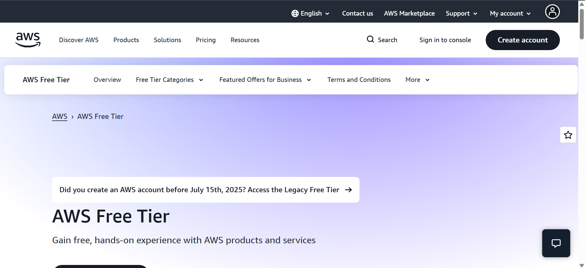

2. Pilih Menu Create Account

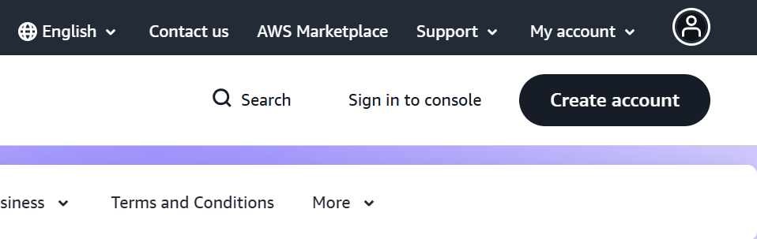
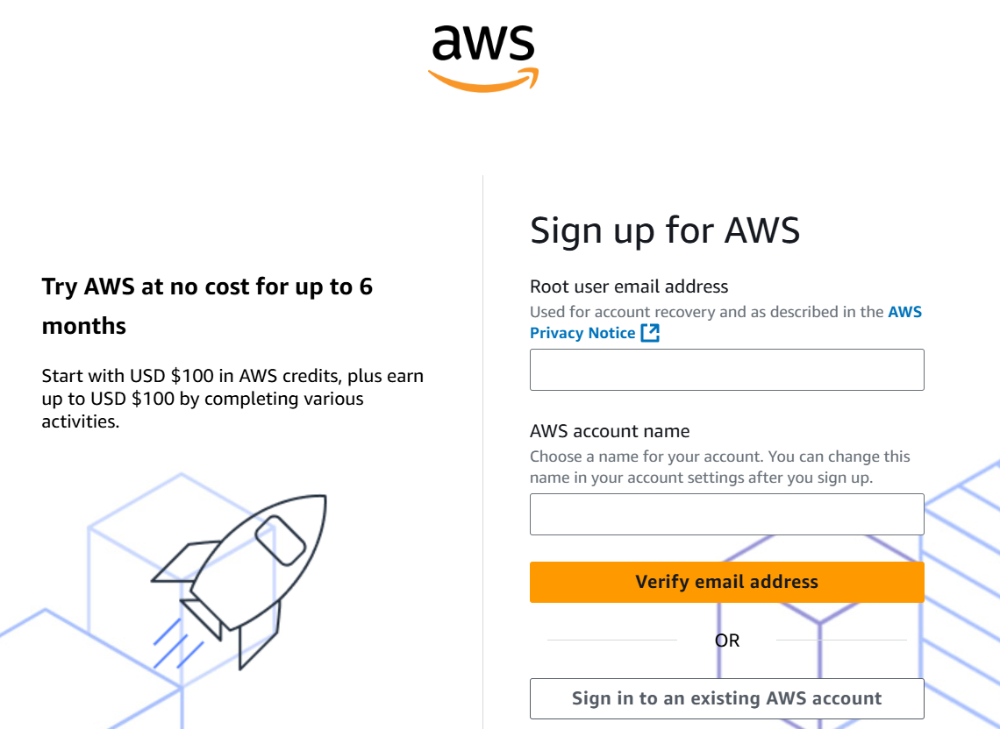

3. Isi Email dan Nama Akun AWS

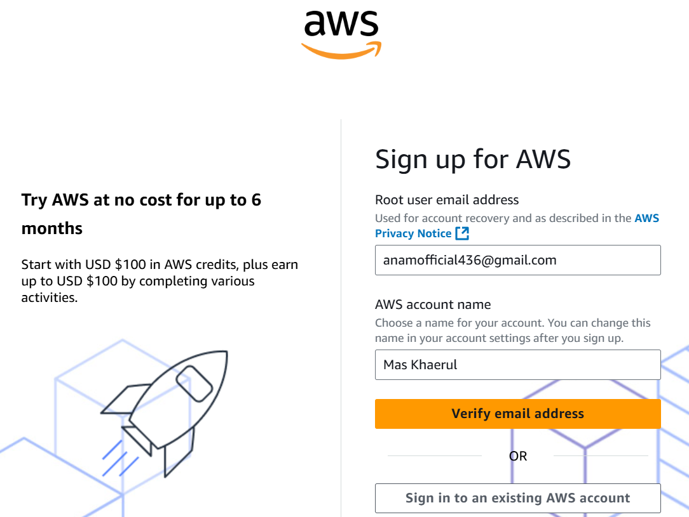

4. Veriry Email Address

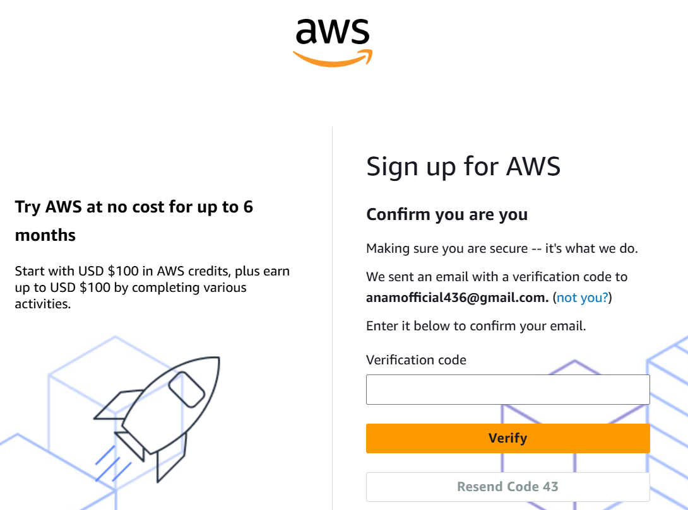

5. Buat Password

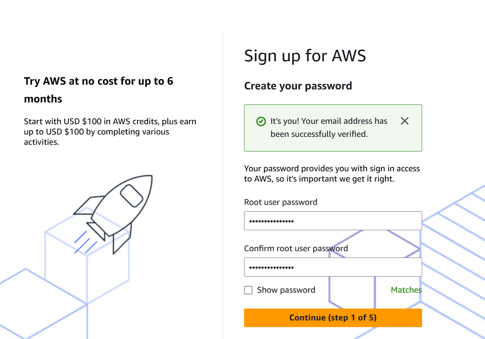

6. Pilih Free Tier

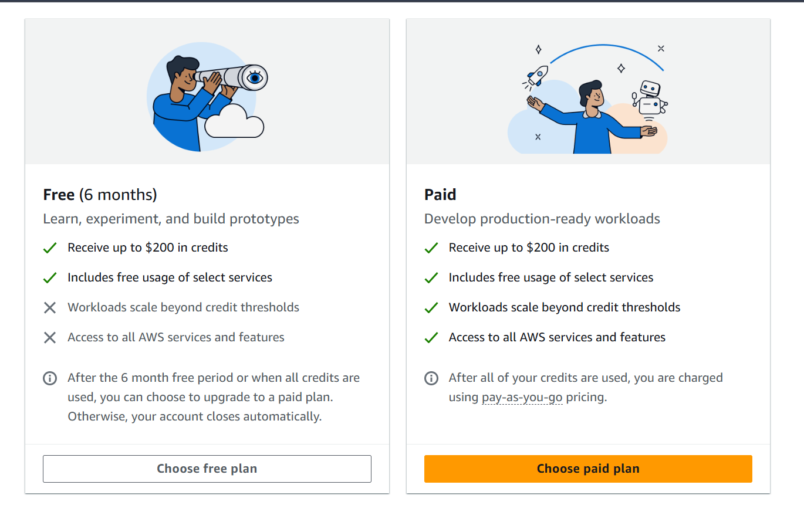

7. Mengisi Personal Information

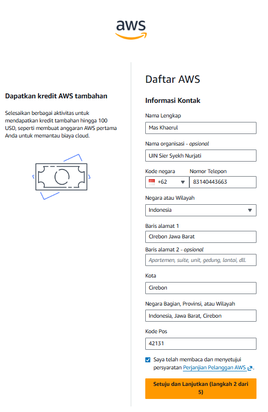

8. Isi Informasi Payment

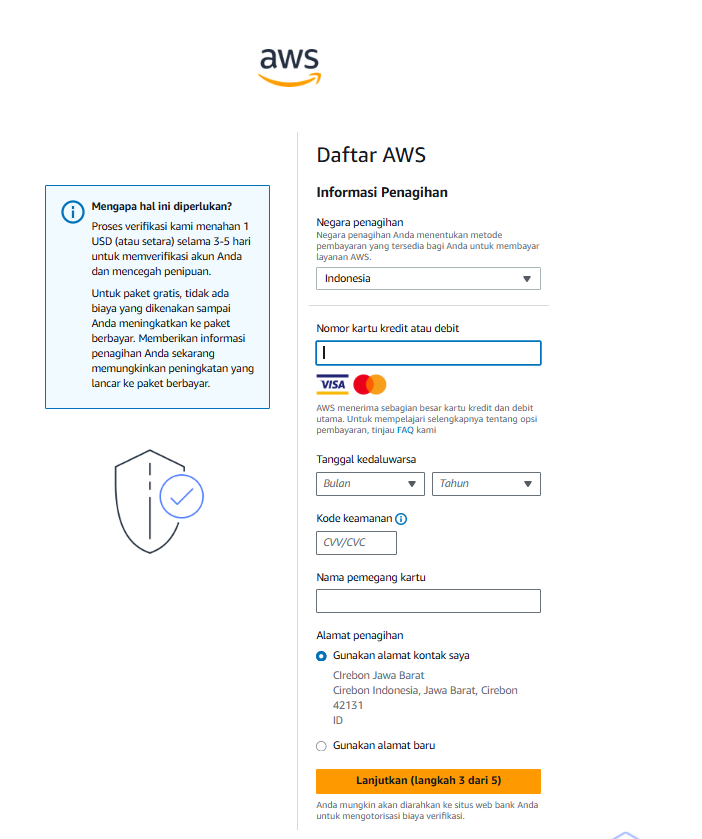

9. Konfirmasi Bisa 3-5

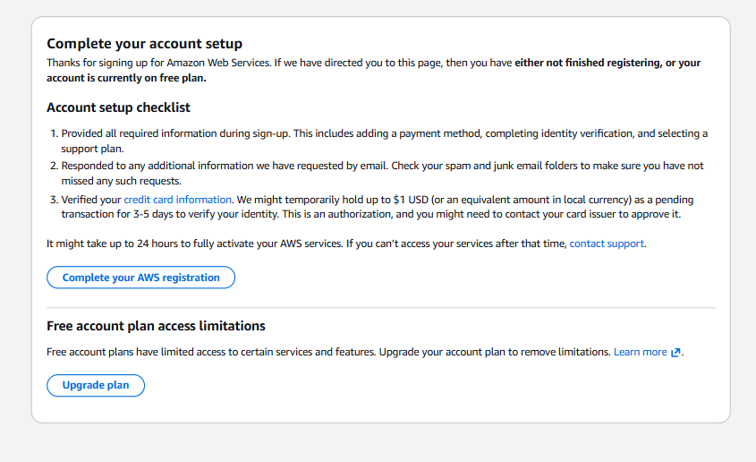

10.Akun Berhasil

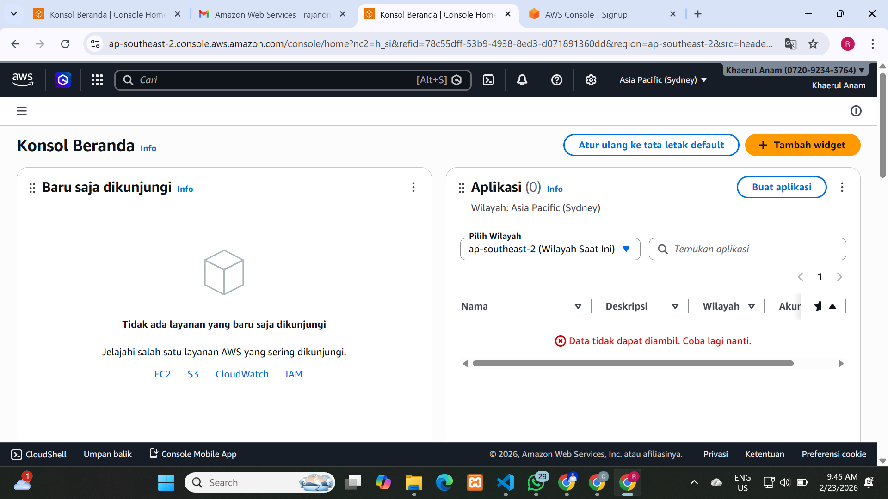

