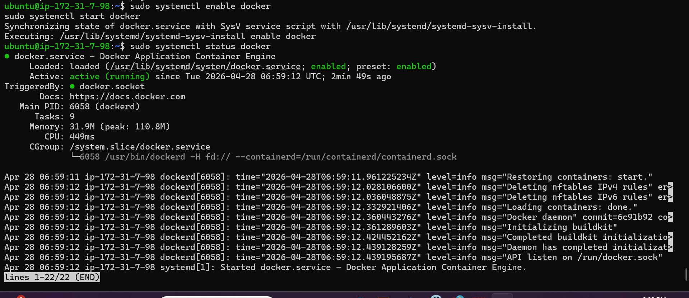
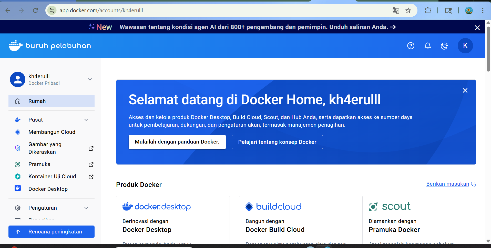
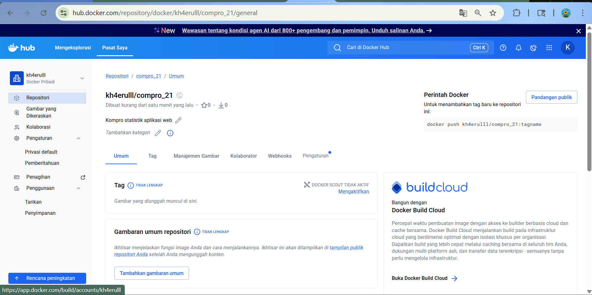
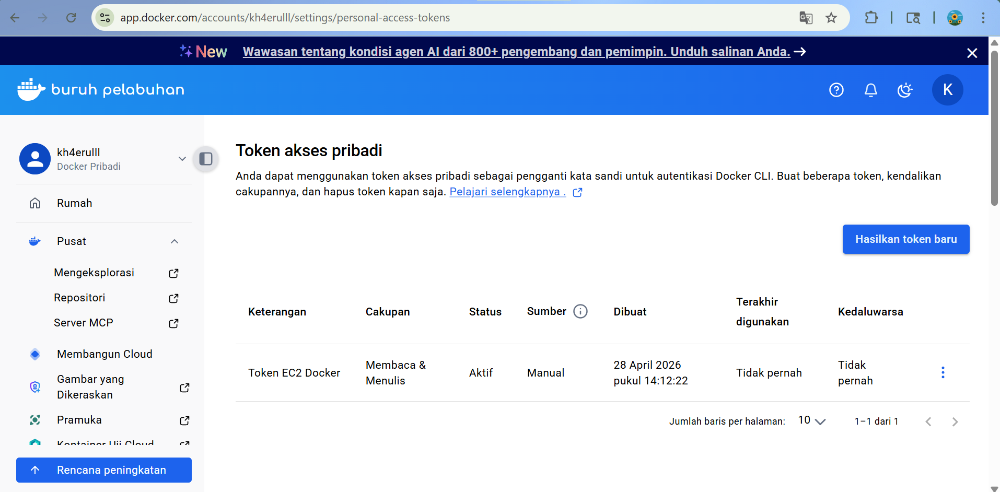
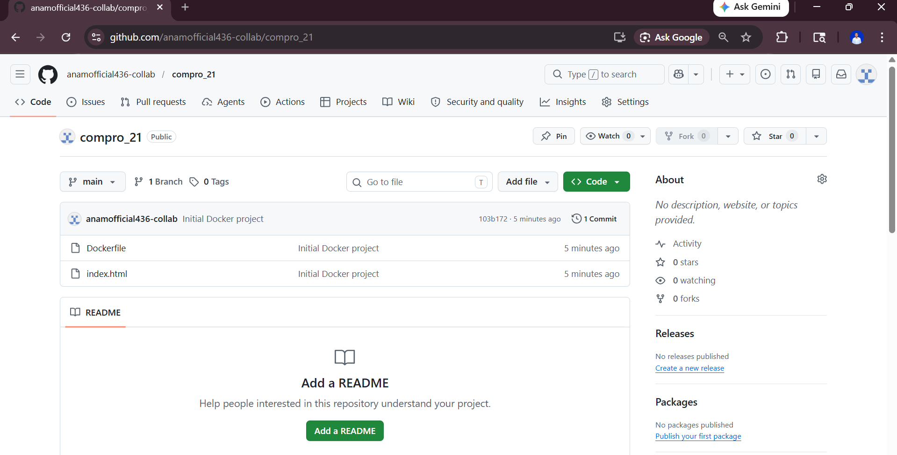

# Intro Docker Engine in EC2

## 1. install based docker documentation https://docs.docker.com/engine/install/ubuntu/

    a. uninstall docker versi lama
    sudo apt remove $(dpkg --get-selections docker.io docker-compose docker-compose-v2 docker-doc podman-docker containerd runc | cut -f1)

    b. add docker repository to APT
        # Add Docker's official GPG key:
    sudo apt update
    sudo apt install ca-certificates curl
    sudo install -m 0755 -d /etc/apt/keyrings
    sudo curl -fsSL https://download.docker.com/linux/ubuntu/gpg -o /etc/apt/keyrings/docker.asc
    sudo chmod a+r /etc/apt/keyrings/docker.asc

    # Add the repository to Apt sources:
    sudo tee /etc/apt/sources.list.d/docker.sources <<EOF
    Types: deb
    URIs: https://download.docker.com/linux/ubuntu
    Suites: $(. /etc/os-release && echo "${UBUNTU_CODENAME:-$VERSION_CODENAME}")
    Components: stable
    Architectures: $(dpkg --print-architecture)
    Signed-By: /etc/apt/keyrings/docker.asc
    EOF

    sudo apt update

    c. install docker engine
    # install docker engine
    sudo apt install docker-ce docker-ce-cli containerd.io docker-buildx-plugin docker-compose-plugin

    d. cek install systemctl status docker

## 2. Registrasi docker Hub

    -URL https://hub.docker.com/signup
    -pake github

## 3. Create Repo for Docker

    - klik menu -> hub -> repositories
    - klik button create a repository
    - isi nama repo dengan = compro_2388010047 dan deskripsi = webstatis compro
    - visibility pilih public
    - klik create

## 4. create token access

    - klik profile -> account settings -> personal access token
    - klik generate new token
    - isi desc = akses web app statis
    - exp date = none
    - klik create

    - simpan token di file txt

    

5. Create file di local
   - baut folder baru compro_2388010047
   - masukkan index.html compro
   - buat file docker dengan isi sebagai berikut
     FROM nginx: alpine
     COPY index.html /usr/share/nginx/html
     EXPOSE 80

6. PUSH PROJECT ke github

