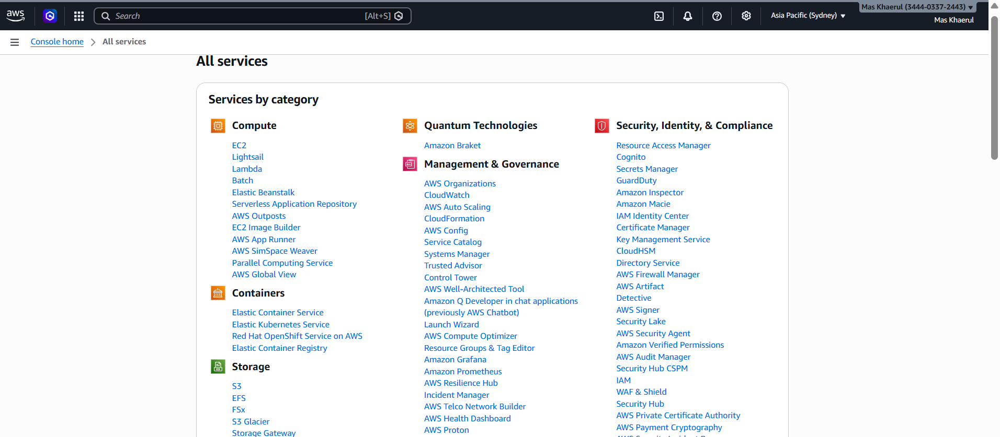
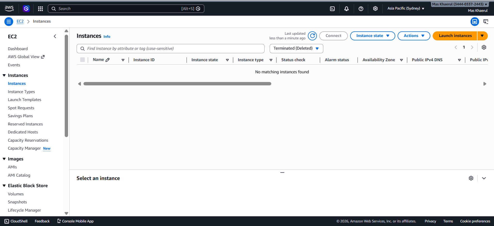
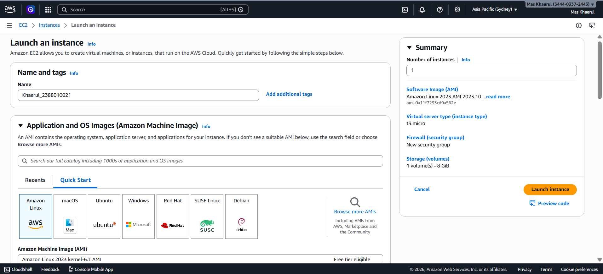
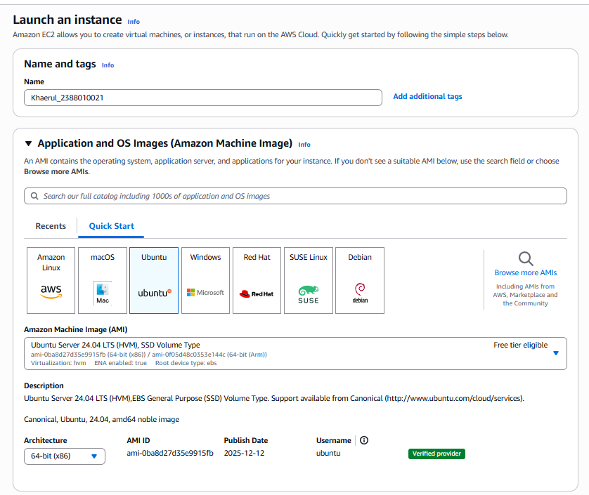
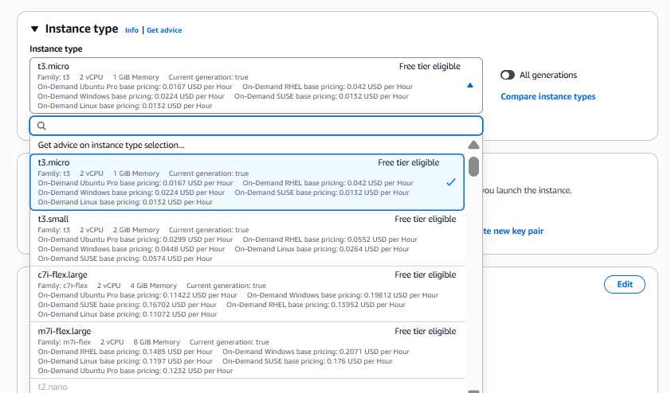
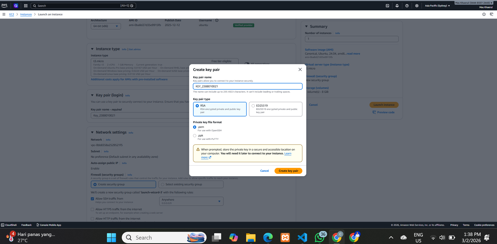
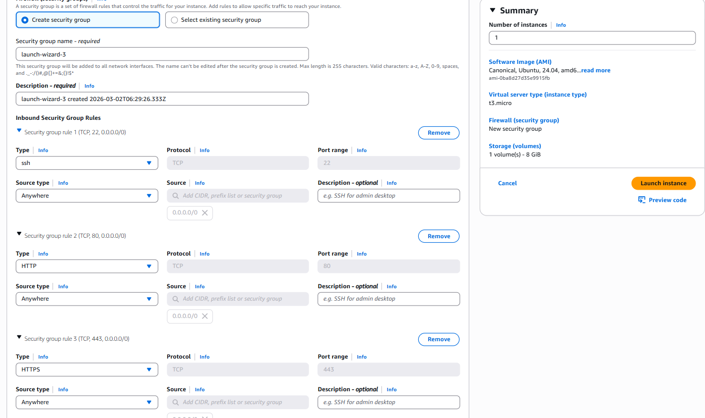
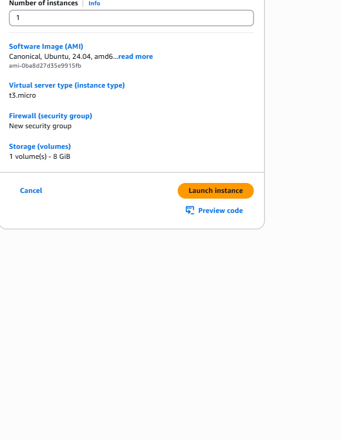
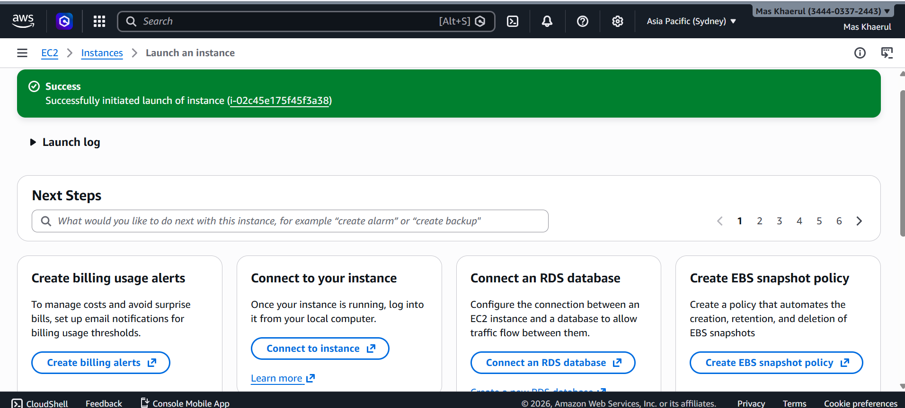

#Membuat EC2/ Instance / VM

1. Pilih menu all services -> Pilih EC2

2. Di dalamn EC2 kita pilih Instance

3. Di dalam menu instance pilih menu low instance

4. Beri nama Instance kita dengan Nama_Nim dan Pilih Ubuntu

5. Pilih resource instance T3.Micro (2VCPU, 1GB Memory)

6. Membuat Key Pair, pilih new key pair, isi nama key, pilih RSA untuk enkripsi, format file.pem, create key pair

7. Setting kebijakan keamanan atau security group

allow SSH = membolehkan remote SSH dari luar
allow HTTPS = instance bisa diakses dari protokol HTTPS
allow HTTP = instance bisa diakses dari protokol HTTP

8. Selesai set up Klik Launch Instances

9. Succes

