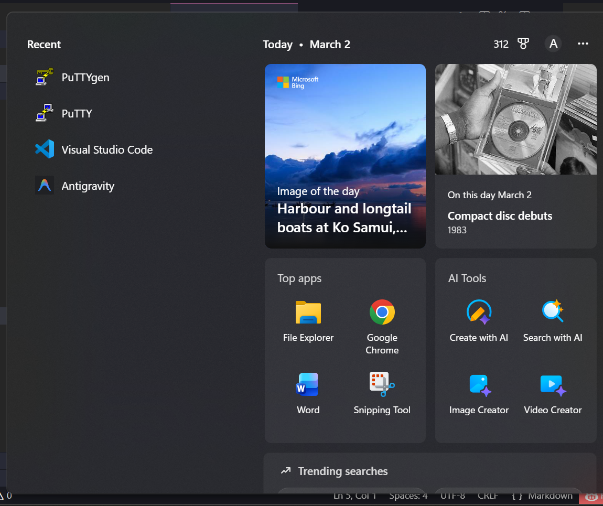
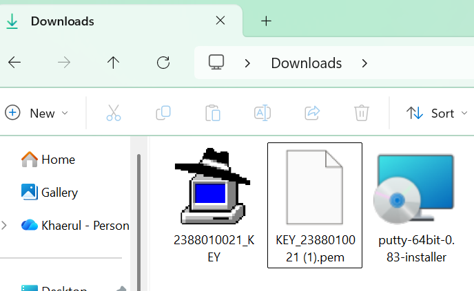
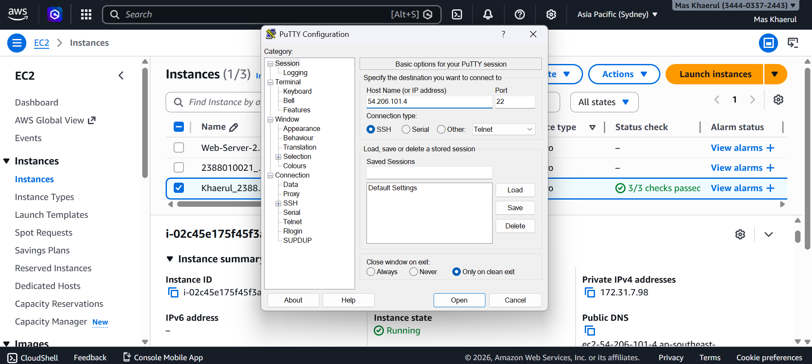
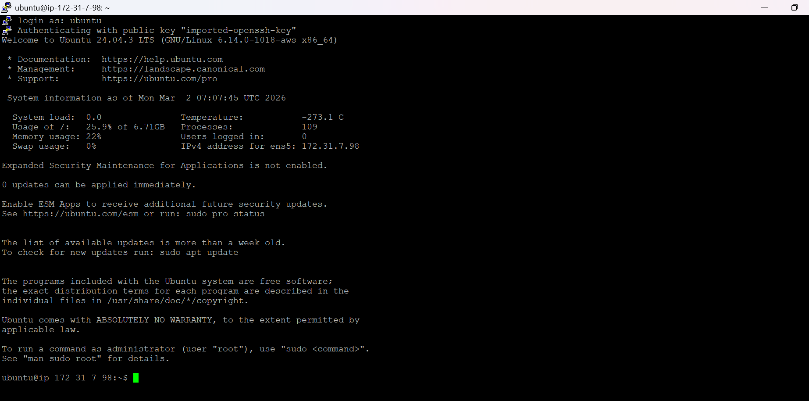
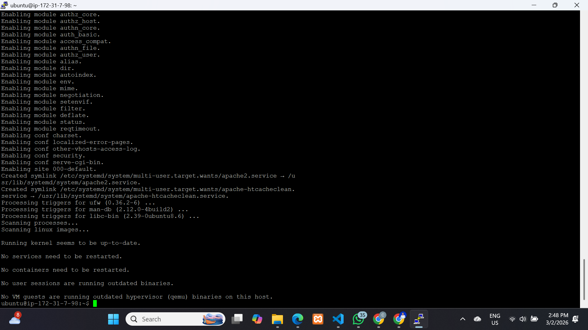
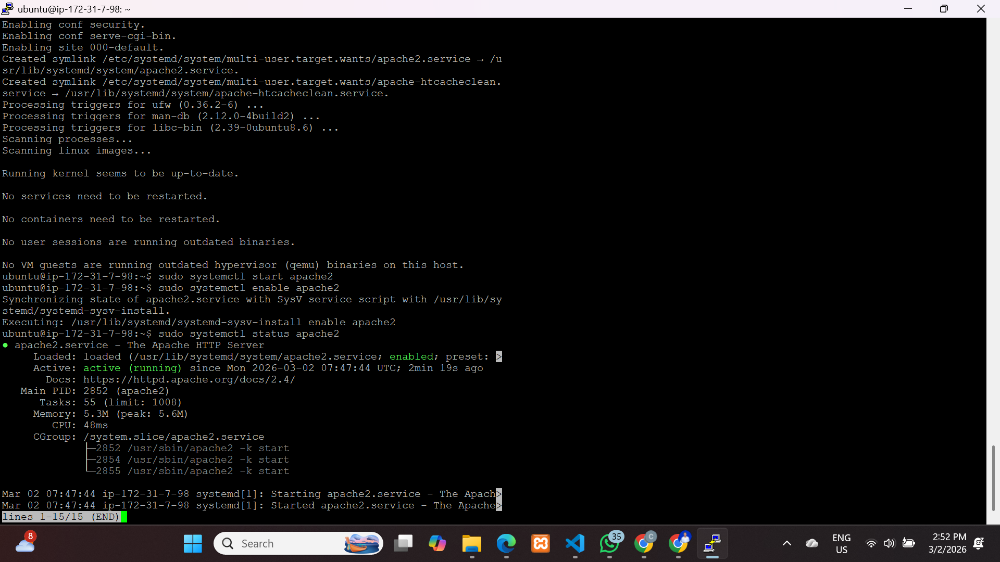
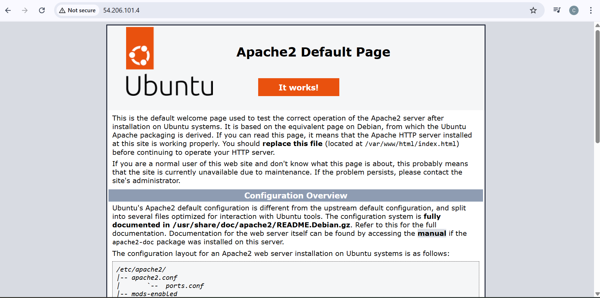
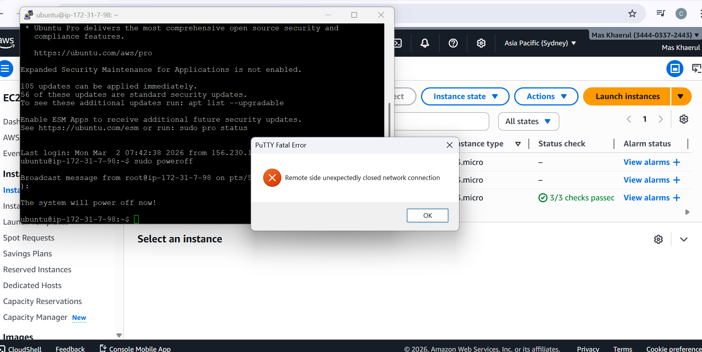
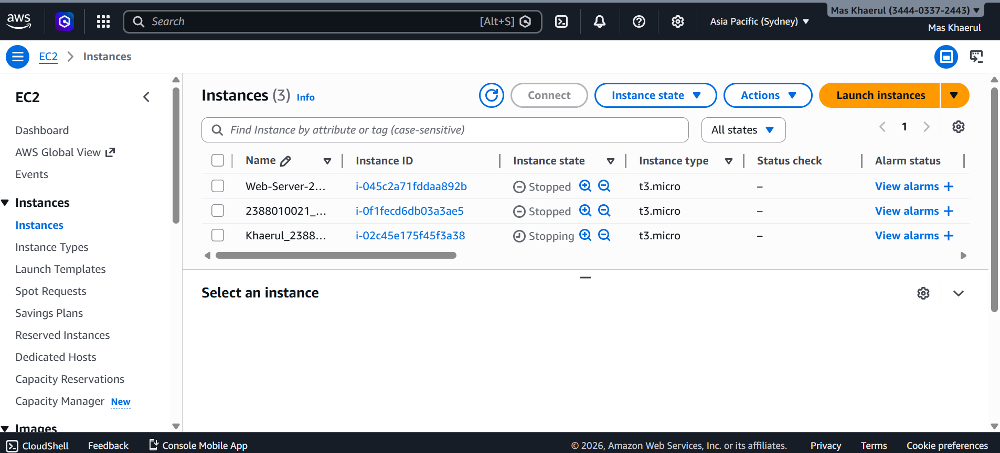

#Remote Instance with SSH putty

1. Pastikan sudah install putty (putty.org/index.html)

2. Konversi file public key dari .pem menjadi .ppk di putty

- Buka puttyGen
- Load file.pem
- Save as .ppk

3. SetUp putty untuk remote SSH

- Buka apps putty
- Isi IP publik sesuai instance masing-masing
- Isi form untuk SSH sesuai Security Group di Instance
- Isi nama session agar saat konek lagi tinggal load saja
- Load file .ppk (klik SSH -> pilih auth -> credentials -> load file .ppk)
- Kembali ke session klik save
- Masukkan username ubuntu

4.  Sudo apt-get Update (Update OS) sudo apt-det upgrade

5.  Pembuktian remote SSH secara visual -copy publik IP address instance paste ke browser

- Isntall web server apache/nginx
- Sudo apt install apache2 -y

6.  Matikan instance agar tidak kena tagihan

