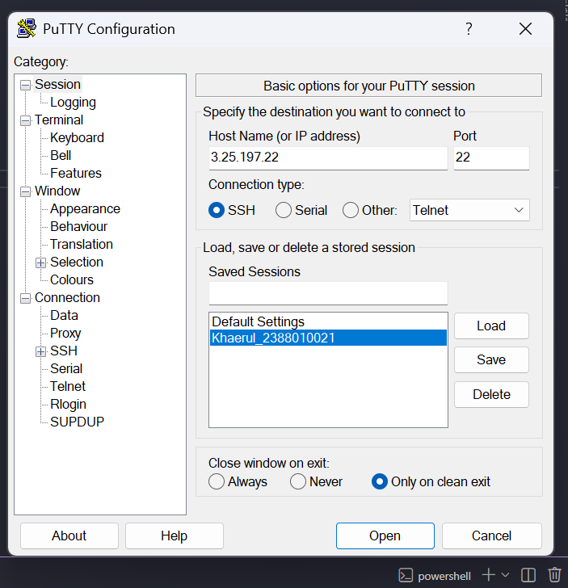
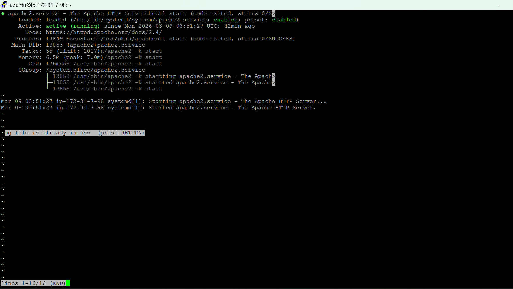
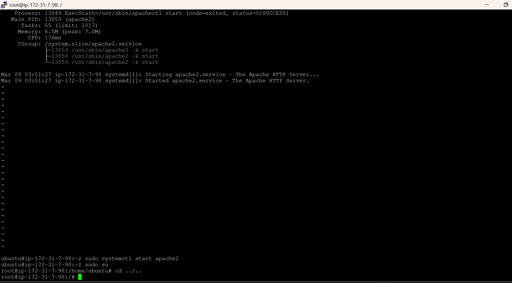
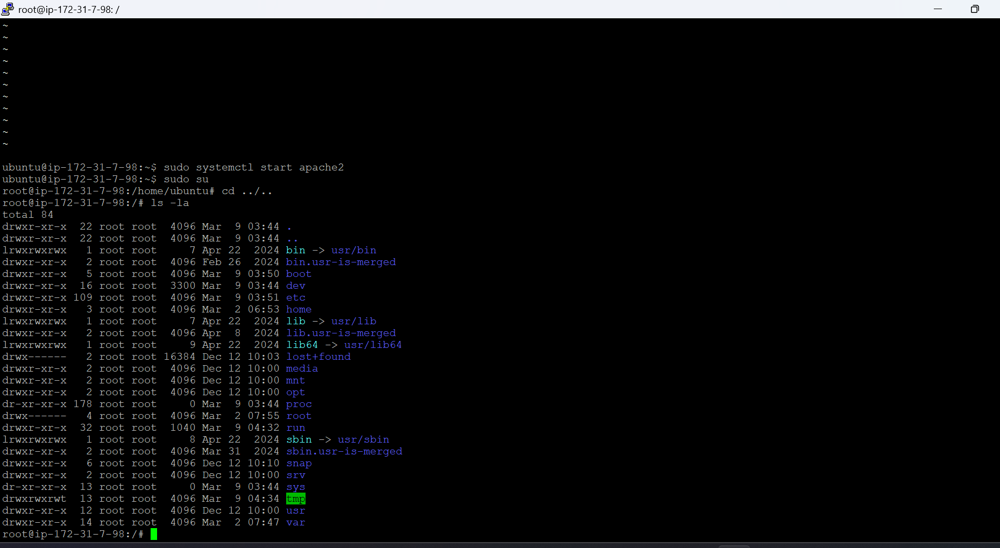
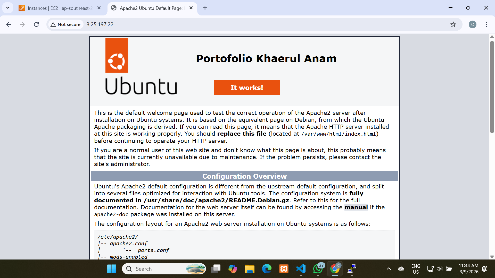

# Implementasi beberapa comand line interface Linux Ubuntu

1. Start instance
2. Buka Putty
3. Kemudian Load save session yang disimpan pada pertemuan_2

4. Update bagian IpAddress V4

Gambar

5. Update Sistem (sudo apt-get update)
6. Cek Status Web Server (systemctl status apache2)
7. Menjalankan Web Server (sudo systemctl start apache2)
8. Menghentikan Web Server (sudo systemctl stop apache2)

9.  Masukan command 1s -la untuk melihat directory temoat cursor aktif
10. Masukan sudo su (Untuk masuk ke Home)
11. Masukan cd ../.. untuk ke Root folder Is -la

12. Masuk ke folder var (cd/var/www/html)
13. nano index.html untuk custom Nama dan Nim

