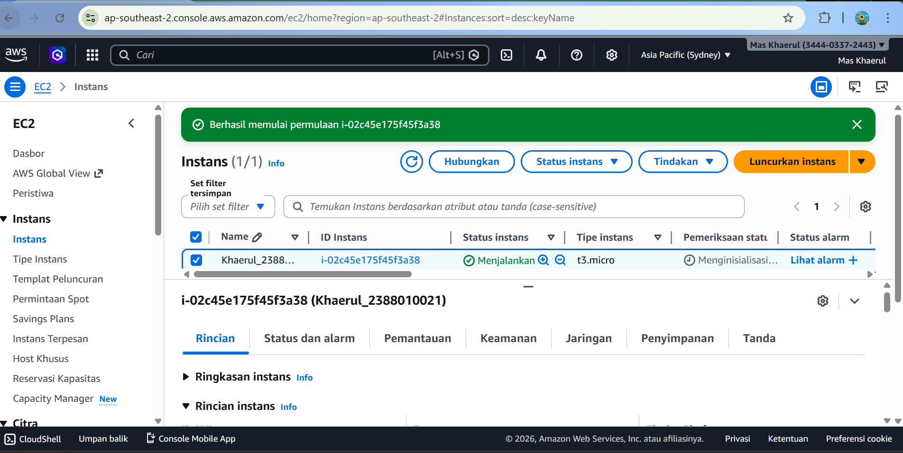
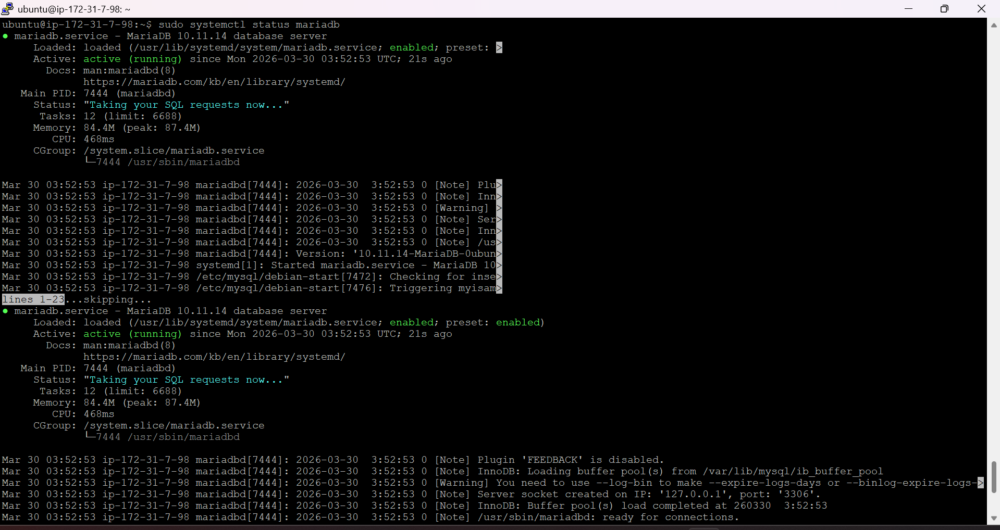
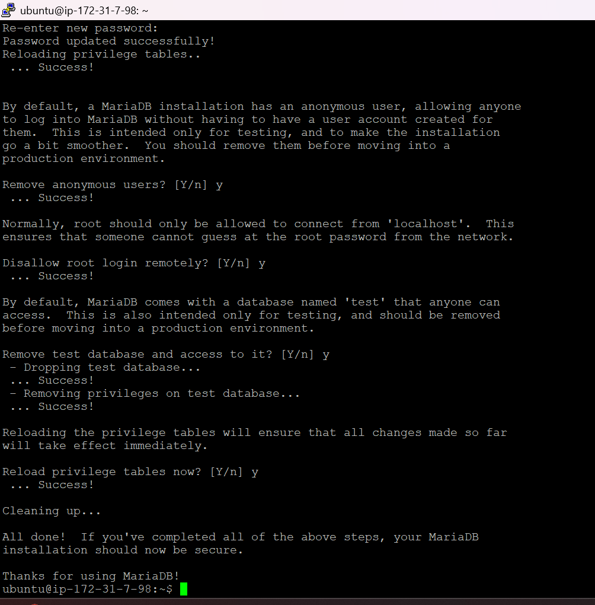
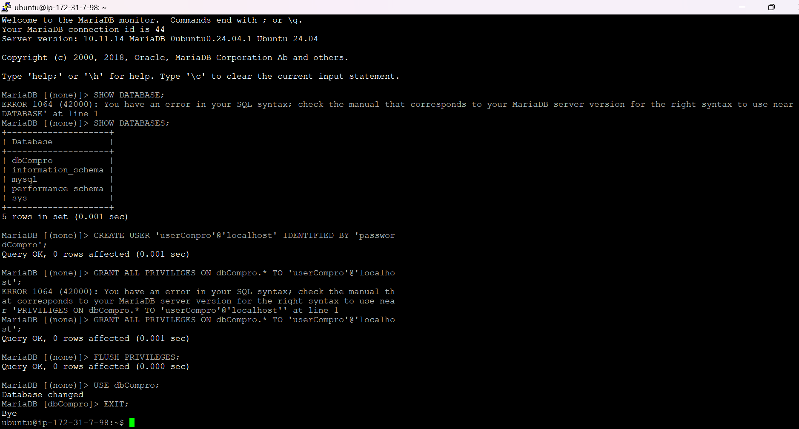
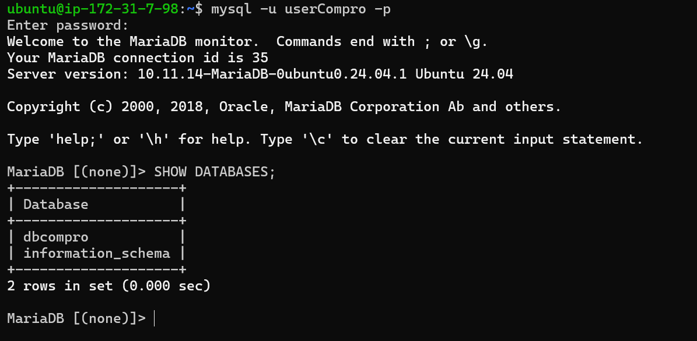

# Membuat Database MySQL di AWS EC2

1. Aktifkan Instance / VM di EC2

2. Remote SSH via Terminal
   - Masuk Ke Folder penyimpnan Private Key AWS
   - Masukan Command (ssh -i namafile.pem ubuntu@[ip addres])
   - Tekan Enter

3. Lakukan Patching OS
   - Sudo apt-get update && sudo apt-get upgrade

4. Kita Instal MariaDB
   - sudo apt-get install mariadb-server / mysql-server
   - sudo systemctl status mariadb

5. Kita lakukan Hardening Security
   - Masukan Command ()
   - masukan pw Kuat untuk user root
   - Remove anonymous users (y)
   - Dissalow root login remotely (y)
   - Remove test datavase and acces (y)
   - Reload privilege tables now (y)

6 Membuat Database dan user

- Membuat database untuk web company profil (create database dbcompro;)
- Membuat User untuk web company profil (create user 'userCompro'@'localhost' identified by "passwordcompro';)
- Memberikan hak akses user untuk web company profil (grant all privileges on dbCompro.\* to 'user Compro'@'localhost';)
- Flush privilege (flush privileges;)
- Keluar dari Mysql (Exit)

7. Login sebagai user baru
   - Masukan Command (mysql -u userCompro -p)
   - Masukan PW
   - Cek apakah databse dbCompro sudah ada

