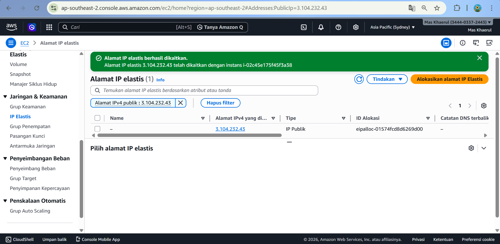

# Membuat Elastic IP Di AWS

1. Jalankan Instans EC2 yang sudah dicreate sebelumnya
2. Ke Menu network and scurity pilih menu elastic-Ip
   - craete menu allocate elastic IP address
   - Pilih Amazon's pool of IPv4 addresses
   - network border group (south east asia)
   - isi tags (Key=server-6B value=Praktikum Elastic IP)

klik Allocate

3. Associate kan elastic IP seger mungkin >1 jam akan kena cost
   - centang mana EIP yang dipilih
   - pilih actions -> associate elastic IP
   - resource type yang pilih instance
   - klik associate

