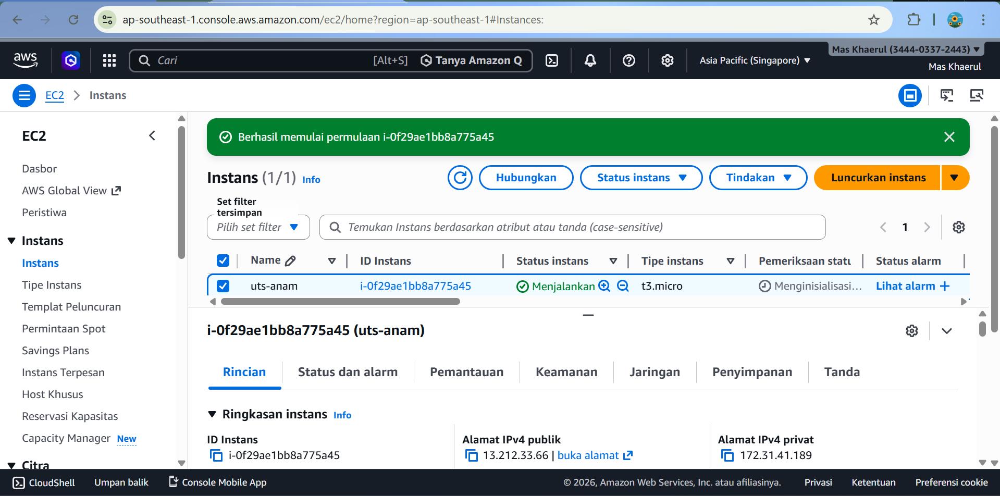
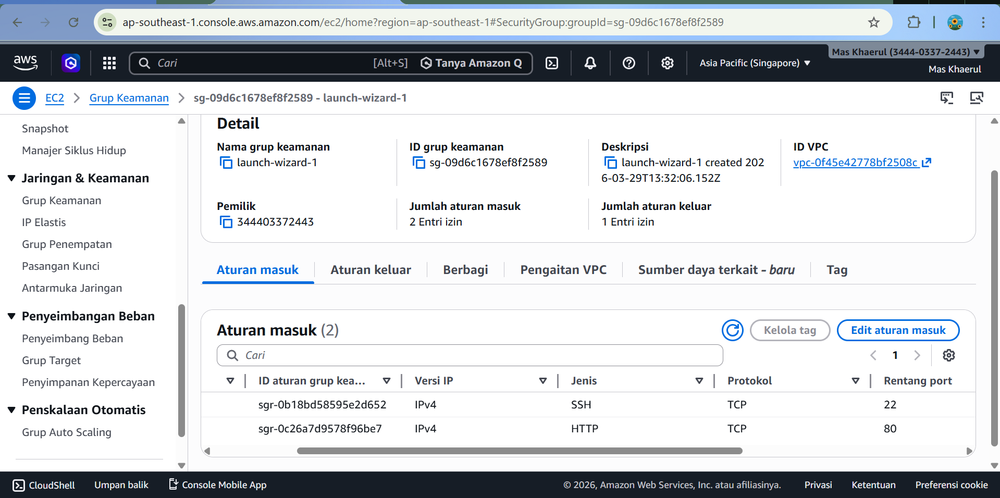
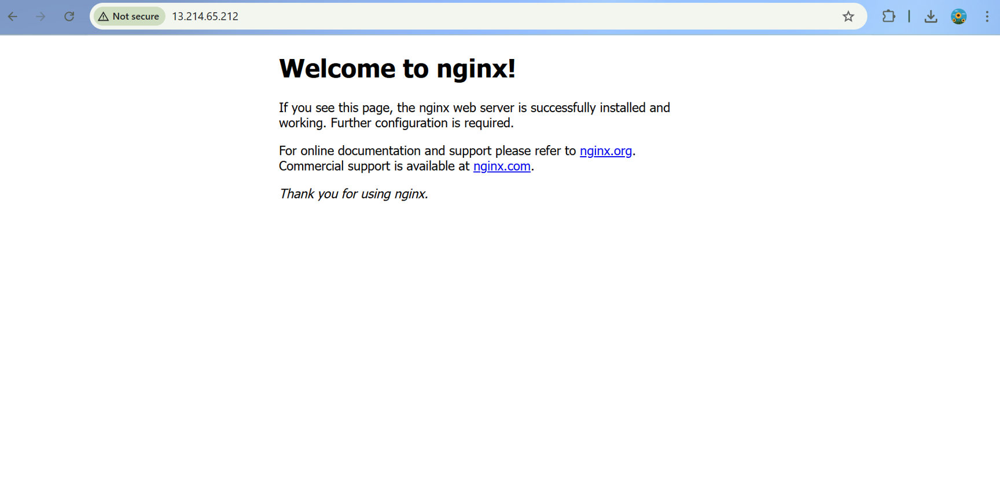
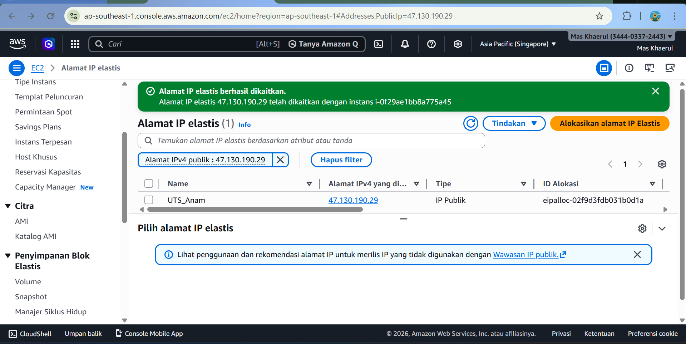
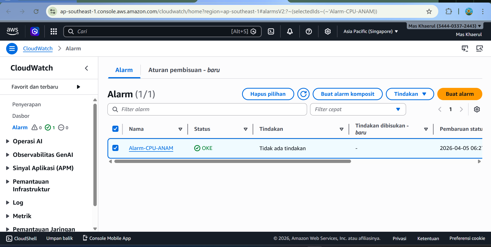

IMPLEMENTASI SERVER DAN DEPLOYMENT WEBSITE
🔹 1. Menjalankan Instance EC2

Pada tahap ini dilakukan pembuatan dan menjalankan instance pada layanan AWS EC2 dengan sistem operasi Ubuntu.

Langkah-langkah:

Masuk ke layanan EC2 pada AWS
Membuat instance baru
Memilih sistem operasi Ubuntu
Menjalankan instance hingga status running

Keterangan:
Gambar menunjukkan instance EC2 yang telah berhasil dijalankan dengan status running dan memiliki alamat IP publik.

🔹 2. Konfigurasi Security Group

Security group dikonfigurasi untuk mengatur akses masuk ke server.

Langkah-langkah:

Membuka pengaturan security group
Menambahkan rule:
Port 22 (SSH) → My IP
Port 80 (HTTP) → 0.0.0.0/0

Keterangan:
Konfigurasi security group memungkinkan akses SSH secara terbatas dan akses HTTP secara publik.

🔹 3. Instalasi dan Konfigurasi Nginx

Web server Nginx diinstal pada instance untuk menjalankan website.

Langkah-langkah:

Mengakses server melalui SSH
Menginstal Nginx
Menjalankan service Nginx

Keterangan:
Nginx berhasil dijalankan dengan status active (running) yang menandakan server aktif.

🔹 4. Deployment Website

File website berupa index.html diunggah ke server dan ditempatkan pada direktori web.

Langkah-langkah:

Upload file ke server
Memindahkan ke /var/www/html
Mengatur permission

📸 Screenshot:
(tempel hasil website di browser)

Keterangan:
Website berhasil ditampilkan melalui browser menggunakan IP publik instance.

🔹 5. Konfigurasi Elastic IP

Elastic IP digunakan agar alamat IP tetap stabil.

Langkah-langkah:

Mengalokasikan Elastic IP
Mengaitkan ke instance

Keterangan:
Elastic IP berhasil dikaitkan sehingga server dapat diakses secara konsisten.

🔹 6. Monitoring dengan CloudWatch

CloudWatch digunakan untuk memantau performa server.

Langkah-langkah:

Membuat alarm
Memilih metrik CPUUtilization
Menentukan threshold > 80%

Keterangan:
Alarm berhasil dibuat untuk memonitor penggunaan CPU pada instance.
