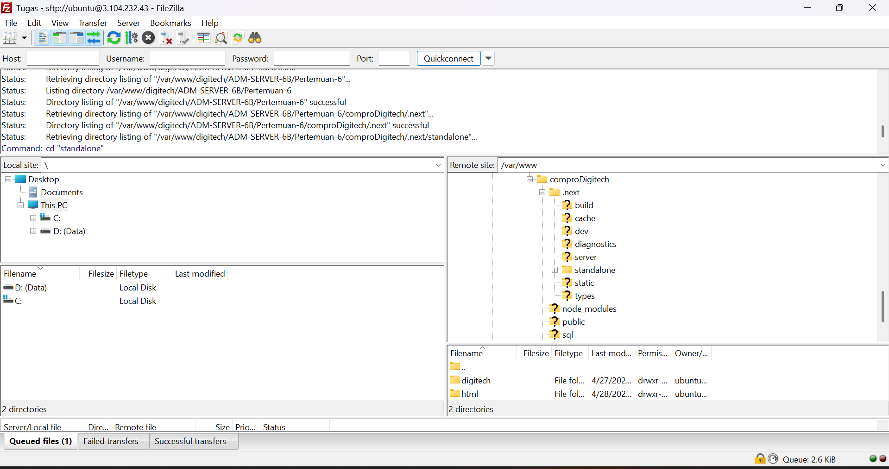
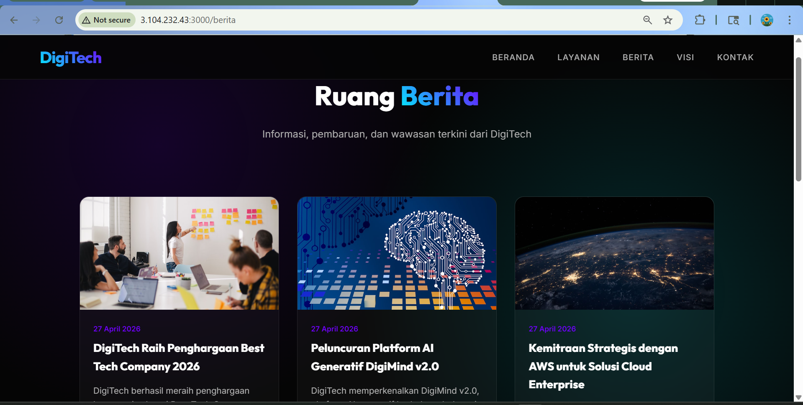

# Melakukan Uploading WEB Apps Dynamic ke EC2 AWS

1. Pastikan Web Apps Dynamic sudah berjalan tanpa error di Localhost
2. Jika sudah tanpa error kita akan membuat folder build
   - npm run build
   - Pastikan menghasilkan folder .next/standalone didalam tersedia Public dan di folder next. ada folder Static

3. Proses Upload File Folder Standalone
   - Lakukan Proses Archive pada folder .next/standalone dan folder Public .zip
   - Running Instance -> Connect Open SSH -> Connect Filezilla
   - upload file hasil archive ke EC2 AWS menggunakan filezilla
   - ekstrak file hasil archive di EC2 AWS
     1. Install tools unzip di ec2 AWS
        - sudo apt install unzip -y
        - cd /var/www/html
        - ls
     2. Ekstract file hasil archive
        - unzip nama_file.zip

4. Export dbcompro dari localhost ke sql
   - login ke SQL
   - use dbCompro;
   - copy paste query sql dari localhost (Engine dihapus)
   - cek apakah tabel sudah terisi
     - select \* from berita;
     - select \* from users;
     - select \* from kontak;
     - select \* from layanan;

5. Sesuaikan isi file .env

DB_HOST=localhost
DB_USER=userCompro
DB_PASSWORD=passwordCompro
DB_NAME=dbCompro
DB_PORT=3306

NEXTAUTH_SECRET=ganti-dengan -string-acak-panjang-minimal-32-karakter
NEXTAUTH_URL=http://34.231.241.197:3000/

6. Di termiinal ssh cd ke folderstandalone run apps
   -pm2 start server.js
   -pm2 save
   -pm2 startup

7. Buka port 3000 di securitygroup ec2 aws

   -edit inbound ruls
   -add rule
   - save
   - check perubahan

