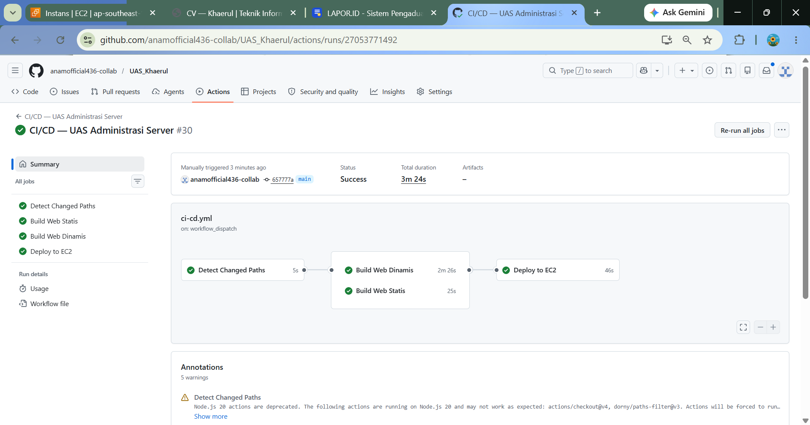
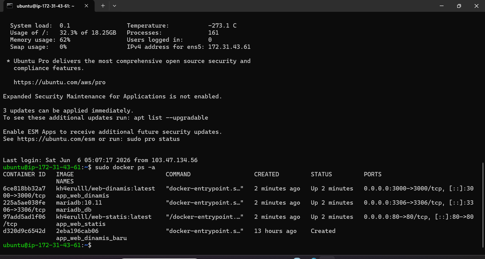
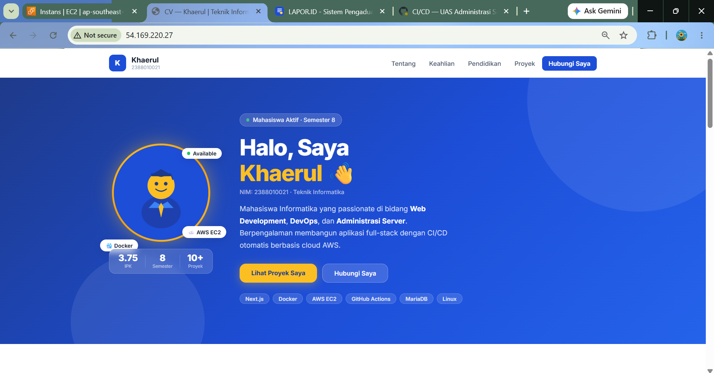
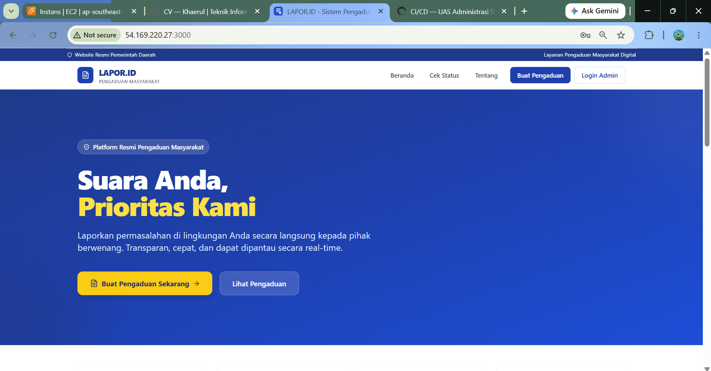
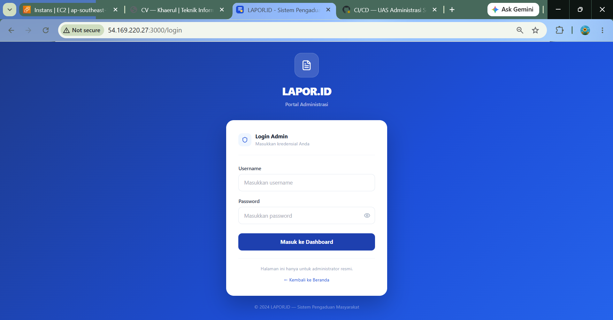
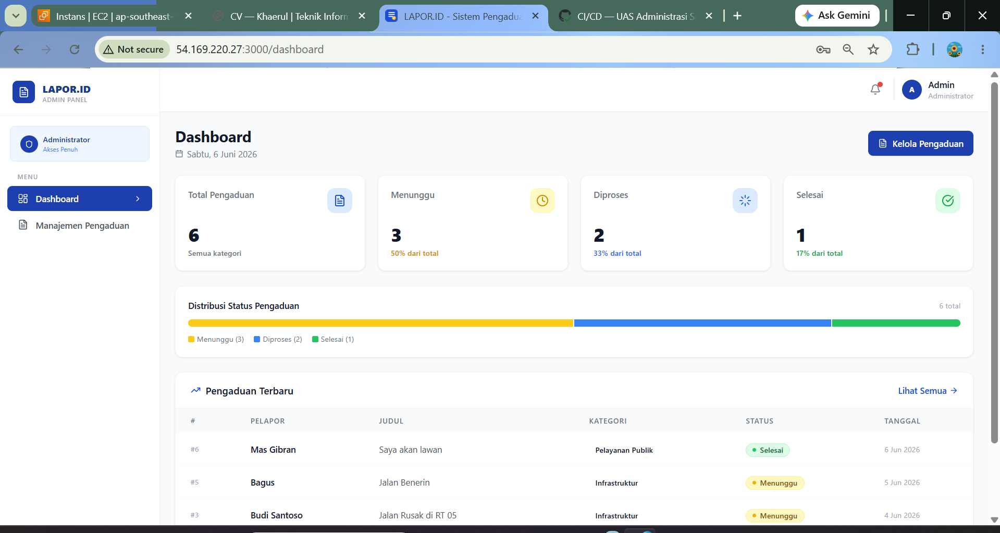

# 📑 Dokumentasi Teknis Ujian Akhir Semester (UAS)

**Mata Kuliah:** Administrasi Server (Cloud Computing II)  
**Dosen Pengampu:** Mohamad Firdaus, M.Kom.

**Nama :** Khaerul Anam  
**Nim :** 2388010021
**Kelas :** INF B

---

## 🚀 Tautan Aplikasi (Production URL)

- **Web Statis (Port 80):** http://54.169.220.27
- **Web Dinamis (Port 3000):** http://54.169.220.27:3000/login

---

## 🛠️ Pembuktian Kriteria Penilaian Rubrik

### 1. Arsitektur CI/CD Pipeline (GitHub Actions)

Pipeline otomatisasi telah dikonfigurasi menggunakan GitHub Actions dengan fitur **Paths Filter** untuk memisahkan isolasi build antara web-statis dan web-dinamis secara efisien. Berikut adalah bukti pipeline berjalan sukses (Centang Hijau):

### 2. Orkestrasi Docker Compose & Jaringan

Seluruh layanan microservices (Web Statis, Web Dinamis, dan MariaDB) diorkestrasikan menggunakan `docker-compose.yml` di dalam satu jaringan internal `uas_default`. Berikut adalah bukti status kontainer yang berjalan aktif (_Up_) di server AWS EC2:

### 3. Fungsionalitas Aplikasi & Automasi Database

- **Web Statis (Reverse Proxy Port 80):** Berjalan normal menampilkan halaman Web CV.
- **Web Dinamis & Fitur Login (Port 3000):** Berjalan lancar menggunakan IP Publik AWS dengan konfigurasi environment variable yang aman. Data ter-seeding secara otomatis ke MariaDB.

#### A. Tampilan Web Statis (Port 80)

#### B. Tampilan Halaman Login Web Dinamis (Port 3000)

#### C. Bukti Sukses Login & Integrasi Database (Dashboard Admin)

---

Link Github : https://github.com/anamofficial436-collab/UAS_Khaerul
